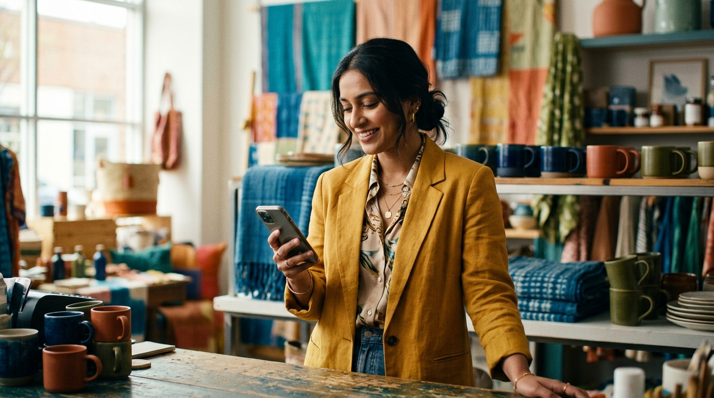

# StepsAI — Homepage Image Prompts

**2026-08-10 rewrite.** Earlier drafts of this file leaned desaturated and moody, and a separate attempt to generate flat-icon UI diagrams for the "how it works" and "every channel" sections read as generic and amateur once placed — both were reverted. Those two sections now build live in HTML/CSS instead (`.flow-steps` in `#setup-teaser`, `.converge` in `#channels-teaser`) and don't need images.

What's left is three real photography slots, rewritten below for **rich, saturated, colorful editorial photography** — not the muted/neutral grade the earlier drafts used. Generate each prompt in whatever tool you're using, then replace that slot's `<div class="image-placeholder">...</div>` block in `index.html` with:

```html
" style="aspect-ratio: 21/9; width:100%; object-fit:cover; border-radius: var(--radius);">
```

(swap the `aspect-ratio` to match the slot, and the filename/alt text to what you actually generated). No other code changes needed — the surrounding section and spacing are already built and reserved.

Brand context, repeated in every prompt so tone stays consistent: **StepsAI is a serious B2B AI-agent product for small and mid-size businesses** — real estate, healthcare, hospitality, education, e-commerce, legal. The brand's accent is blue (`#1A56DB`), but the *photography* doesn't need to be muted to feel premium — real product color, real environments, real light. Think the vibrancy of a Shopify or Mailchimp campaign shoot, not the desaturated grey-beige of generic corporate stock. Never a laptop showing a fake dashboard, never a glowing purple orb, never a stock-photo grin.

---

## Slot 1 — Post-hero brand statement

**Placement:** Full-width band directly under the homepage's interactive hero demo. First photo a visitor sees. Job: make the brand feel real, human, and alive right after the UI demo, before the page gets into features.

**Aspect ratio:** 21:9 (ultra-wide banner)

**Prompt:**

> Vibrant editorial commercial photography, wide 21:9 banner composition, shot like a real campaign photo, not stock. A small business owner in their late 20s to early 40s, South Asian, standing behind the counter of their own boutique shop, surrounded by richly colored merchandise in sharp, saturated hues (think jewel-toned textiles, brightly packaged goods, or colorful ceramics — pick one specific, vivid product world and commit to it). They're glancing at a smartphone in one hand with a genuine, relaxed half-smile, quiet relief rather than a big grin. Natural daylight pours in from a large window, warm and bright, casting real contrast and color into the scene rather than flattening it. Shot on a 50mm-equivalent lens, shallow depth of field, background a soft wash of color from the shop's own products and shelving. Color grade: punchy, true-to-life, high in chroma but not neon — real saturated color the way a well-lit retail campaign photo looks, not a muted corporate stock photo. Let the brand's blue (`#1A56DB`) appear naturally somewhere in frame (a price tag, an apron, a stool, a signage element) without dominating the palette. No visible phone screen content, no readable text or logos anywhere in frame, no laptop. Composition: subject positioned right-of-center, generous negative space on the left third for a headline to sit over. Mood: capable, warm, in control, and visually alive. Photographic, not illustrated. No text, no watermark, no UI overlays.

**Avoid:** desaturated or grey-toned grading, stock-photo grins, staged "call center" headset imagery, visible brand logos, a phone screen showing any UI, generic "tech startup" photography (glass office, hoodies, laptop stickers), muddy or flat lighting.

---

## Slot 2 — Mid-page breadth statement

**Placement:** Between the "Every channel" section and the "Industries" list. Job: convey energy and breadth (this works across many kinds of businesses) right before the visitor sees the actual industry list.

**Aspect ratio:** 16:7 (wide, shorter than slot 1)

**Prompt:**

> Vibrant editorial commercial photography, wide 16:7 banner composition, shot with real color and life, not a muted corporate tone. A bustling small-business street scene in bright midday light: a market stall or shopfront with colorful awnings, produce, or merchandise in the foreground, slightly blurred to imply motion and energy, and in sharp focus in the mid-ground, a business owner or courier holding a smartphone, checking it mid-stride with a confident, purposeful expression. Rich, saturated color throughout — warm terracotta, deep greens, bright textile colors, whatever fits the specific scene you choose — shot like a real travel-meets-commerce editorial spread, full of visual texture and life, not a sterile "diverse stock photo" composite. Natural daylight, high contrast, true color (no desaturation, no grey-wash filter). A single cool blue tone allowed to appear naturally in the phone's screen glow or a small storefront detail, subtle against the warmer palette. Composition: the busy scene occupies the lower two-thirds, with a calmer sky or awning line in the upper third for a heading to sit over. Mood: energetic, real, thriving — an ordinary business day, but vivid. Photographic, not illustrated. No readable text, no logos, no watermark.

**Avoid:** desaturated or muted grading, a literal collage of unrelated business photos (real estate plus hospital plus hotel side by side), airport-lounge or coworking-space cliché, generic "diverse people high-fiving" stock imagery, flat overcast lighting.

---

## Slot 3 — Final CTA closing mood

**Placement:** Inside the dark final call-to-action section, below the scrolling ticker, above the footer. This is the only dark section on the page. Smaller, centered (max-width 720px), so it reads as a strong accent, not a dominant banner.

**Aspect ratio:** 21:9 (ultra-wide, narrow band)

**Prompt:**

> Moody but richly colorful editorial photography, wide 21:9 banner composition, dark overall exposure (matching a near-black `#060B16` background) with most of the frame in deep shadow, but the lit area carrying real, saturated color rather than a flat grey glow. A smartphone rests on a dark surface, screen lit up mid-notification, the glow a vivid, saturated blue (matching brand blue `#1A56DB`) spilling rich color across the surface around it, with a faint warm rim of ambient light elsewhere in the frame (a sliver of warm lamp-light in the far background, out of focus) so the image reads as colorful and alive rather than monochrome-dark. No hand, no face, no person in frame, just the phone and the implication a message just arrived. Screen content abstracted, no legible text, just saturated color glow. Extremely shallow depth of field, cinematic, single dominant light source from the screen with a secondary soft warm accent light for color contrast. Composition: phone positioned slightly off-center, generous dark negative space around it for a headline and button to sit over. Mood: quiet but vivid, a little tense, someone needs an answer right now. Photographic, not illustrated, not a screen-recording, not a UI mockup.

**Avoid:** flat monochrome-grey darkness with no color contrast, any visible app UI or text on the phone screen, a hand or face in frame, an over-lit daytime feel, purple or violet tones (this brand is blue only), stock "person texting in bed" imagery.

---

## Notes for whoever generates these

- All three should feel like the same photographic world: real, vivid color, genuine light, no illustration or 3D-render look. Slots 1 and 2 are bright and saturated; slot 3 is dark but still carries real color in its lit areas, not a grey wash.
- If your tool outputs multiple variations, prefer the one where the blue accent appears naturally in-scene rather than added as a filter — it should look found, not branded.
- None of these need any text, logo, or UI baked into the image itself — all of that is handled in code around the image.
- Once generated, drop the files into `images/` and swap the matching `<div class="image-placeholder">` block for the `` snippet at the top of this file — the surrounding section, spacing, and aspect-ratio are already in place.
